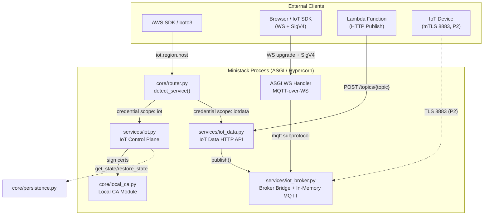
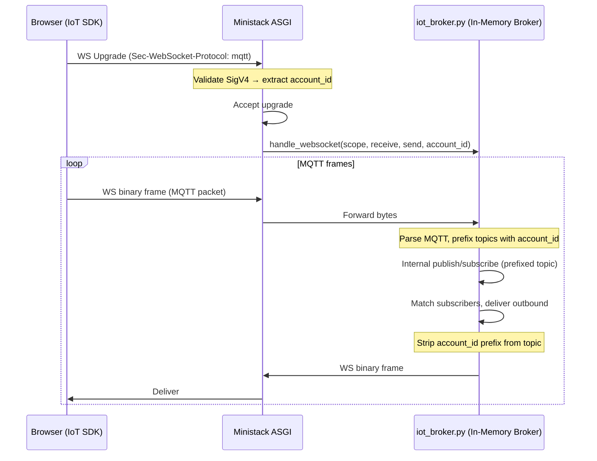
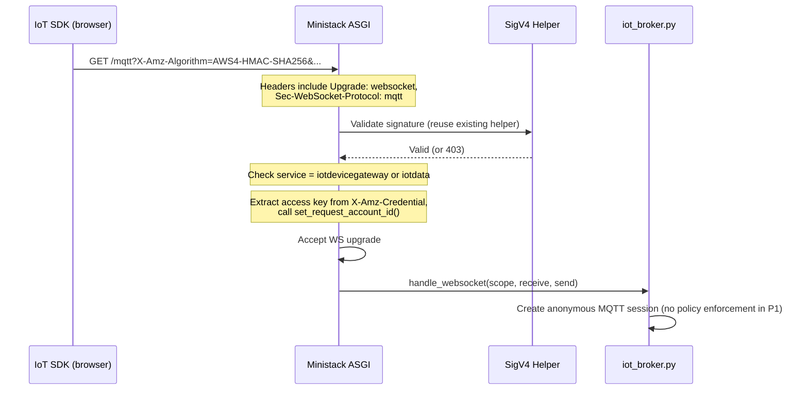
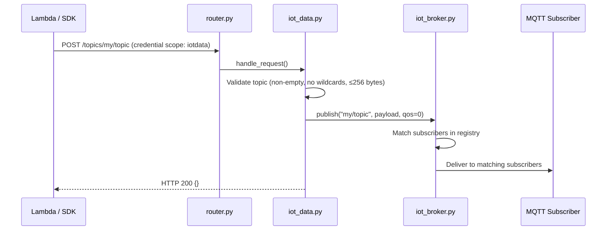
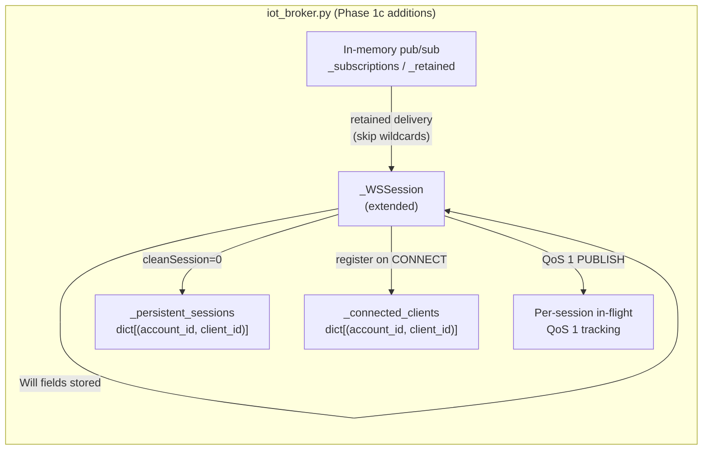

# Design Document — AWS IoT Core (Phase 1a + 1b)

## Overview

This design covers Phase 1a (control plane) and Phase 1b (data plane) of AWS IoT Core support in Ministack. The goal is to unblock the original use case from issue #564: a Lambda function publishes via `iot-data Publish` over HTTP, and a browser subscribes over MQTT-over-WebSockets using the official AWS IoT SDK (SigV4-signed upgrade).

**Phase 1a** delivers the control-plane CRUD service module — Things, ThingTypes, ThingGroups, Certificates (with Local CA), Policies, and `DescribeEndpoint` — as a standard Ministack JSON/REST service with no broker dependency.

**Phase 1b** adds the data plane — an embedded MQTT broker, the Broker Bridge interface, MQTT-over-WebSocket on the gateway port, SigV4-signed WS upgrades, and the `iot-data Publish` HTTP API.

**Future work (out of scope):** Phase 2 (Shadows, mTLS on 8883, GetRetainedMessage) and Phase 3 (Rules Engine, Jobs, Fleet Provisioning) are deferred.

## Architecture



### Key Design Decisions

| Decision | Choice | Rationale |
|----------|--------|-----------|
| Broker strategy | Custom in-memory Python broker | In-process pure-Python MQTT 3.1.1 pub/sub registry with its own frame codec. Zero external dependencies, zero IPC, direct async calls. No binary dependency, no Docker sidecar, no image-size concern. |
| MQTT-over-WS port | Multiplexed on gateway port (4566) | Matches AppSync Events pattern. The ASGI app already dispatches WebSocket upgrades by host header. IoT WS uses `Sec-WebSocket-Protocol: mqtt` on the IoT data hostname. |
| DescribeEndpoint hostname | `<prefix>-ats.iot.<region>.<MINISTACK_HOST>` | Follows AWS format. Router matches via `host_patterns: [r"\.iot\."]` and credential scope `iot`/`iotdata`. The prefix is a deterministic hash of the account ID. |
| Local CA placement | `ministack/core/local_ca.py` | Reusable by ACM and API Gateway. Wraps `cryptography` library for CA generation and leaf signing. |
| Phase 1 auth | Anonymous CONNECT only | Simplest path to unblock the use case. SigV4 on WS upgrade is validated (reusing existing SigV4 helper) but does not enforce IoT policies. |
| Multi-tenancy | Single broker, session-level account scoping (Transfer Family pattern) | Control-plane state is isolated per account via `AccountScopedDict`. The MQTT broker is a single shared instance. Account isolation is enforced at the session/bridge layer: SigV4 on WS upgrade identifies the account; in P2, mTLS client certs are looked up to resolve the owning account (same as Transfer Family resolving SFTP users by SSH key). Anonymous TCP connects map to the default account. Topics are internally prefixed with account ID by the bridge, transparent to clients. |

## Components and Interfaces

### Module Layout

```
ministack/
├── core/
│   ├── local_ca.py          # NEW — Local CA (generate CA, sign leaf certs)
│   ├── router.py            # MODIFIED — add "iot" and "iot-data" service patterns
│   ├── persistence.py       # UNCHANGED — used by iot.py via get_state/restore_state
│   └── tls.py               # UNCHANGED
├── services/
│   ├── iot.py               # NEW — IoT control plane (Things, Certs, Policies, Endpoint)
│   ├── iot_data.py          # NEW — iot-data HTTP API (Publish)
│   └── iot_broker.py        # NEW — Broker Bridge + in-memory MQTT broker
└── app.py                   # MODIFIED — register iot/iot-data services, add IoT WS dispatch
```

### Service Registration (router.py changes)

```python
# In SERVICE_PATTERNS:
"iot": {
    "host_patterns": [r"iot\."],
    "credential_scope": "iot",
},
"iot-data": {
    "host_patterns": [r"data-ats\.iot\.", r"data\.iot\."],
    "credential_scope": "iotdata",
    "path_prefixes": ["/topics/"],
},
```

```python
# In app.py SERVICE_REGISTRY:
"iot": {"module": "iot"},
"iot-data": {"module": "iot_data"},
```

The `_S3_VHOST_EXCLUDE_RE` pattern in `app.py` will be extended to include `iot` hostnames so they are not misrouted to S3.

### WebSocket Dispatch (app.py changes)

The existing WebSocket dispatch block in `app.py` (line ~1360) checks for `execute-api` and `appsync-realtime-api` hosts. A new check will be added for IoT data hostnames:

```python
_IOT_DATA_WS_RE = re.compile(r"\.iot\." + re.escape(_MINISTACK_HOST) + r"(?::\d+)?$")

# In the websocket scope handler:
iot_ws_m = _IOT_DATA_WS_RE.search(ws_host)
if iot_ws_m:
    # Check Sec-WebSocket-Protocol contains "mqtt"
    await _get_module("iot_broker").handle_websocket(scope, receive, send)
```

### Broker Bridge Interface (`iot_broker.py`)

```python
"""Broker Bridge — custom in-memory MQTT 3.1.1 broker with session-level account scoping.

Implements a pure-Python pub/sub registry with its own MQTT frame codec. Handles
WebSocket connections directly through the ASGI layer. The bridge terminates
connections, resolves the account (via SigV4 on WS, or client cert on mTLS in P2),
and manages subscriptions with transparent topic prefixing.

Architecture:
  Client → [WS on gateway (P1b) / TLS 8883 (P2b)] → Bridge (in-memory broker)
  
No external broker process. All multi-tenancy logic lives in the bridge.
No plain TCP 1883 — matches real AWS IoT Core which requires TLS or SigV4 on all connections.
"""

import asyncio
from typing import Callable, Awaitable

# Public interface consumed by iot_data.py and (future) rules engine
async def start_broker() -> None:
    """Start the internal broker."""

async def stop_broker() -> None:
    """Graceful shutdown of broker."""

async def publish(account_id: str, topic: str, payload: bytes, qos: int = 0, retain: bool = False) -> None:
    """Publish a message scoped to account_id. Internally prefixes topic."""

async def subscribe(account_id: str, topic_filter: str, callback: Callable[[str, bytes, int], Awaitable[None]]) -> str:
    """Subscribe scoped to account_id. Internally prefixes topic filter. Returns subscription_id."""

async def unsubscribe(subscription_id: str) -> None:
    """Remove a subscription."""

async def handle_websocket(scope: dict, receive, send, account_id: str) -> None:
    """Handle an MQTT-over-WebSocket connection. Account already resolved from SigV4."""

def is_available() -> bool:
    """Return True if the broker module is operational."""
```

**Topic prefixing (transparent to clients):**
- When a client in account `123456789012` publishes to `sensors/temp`, the bridge internally publishes to `123456789012/sensors/temp` on the broker.
- When a client subscribes to `sensors/#`, the bridge subscribes to `123456789012/sensors/#`.
- Outbound messages strip the prefix before delivery to the client.
- This ensures complete topic isolation without running separate broker processes.

The broker is started lazily on first `publish()`, `subscribe()`, or WebSocket connection. Phase 1a control-plane operations work without the broker running.

### IoT Control Plane (`iot.py`)

Follows the standard Ministack service pattern:

```python
async def handle_request(method: str, path: str, headers: dict, body: bytes, query_params: dict) -> tuple:
    """Route IoT control-plane API actions."""

def get_state() -> dict:
    """Return serializable state for persistence."""

def restore_state(data: dict) -> None:
    """Restore state from persistence."""

def reset() -> None:
    """Clear all state (called by /_ministack/reset)."""
```

Actions are dispatched by the `Action` header or `x-amz-target` (IoT uses JSON body with `Action` in the URL path for some operations, but primarily uses the standard AWS JSON 1.1 protocol with target headers).

IoT control-plane actions use the `x-amz-target` pattern: the SDK sends requests with target header values like `AWSIotService.CreateThing`. The router detects the service via credential scope (`iot`) or host pattern (`iot.<region>.<host>`).

### IoT Data HTTP API (`iot_data.py`)

```python
async def handle_request(method: str, path: str, headers: dict, body: bytes, query_params: dict) -> tuple:
    """Handle iot-data HTTP API requests."""
    # POST /topics/{topic} → publish via Broker Bridge
    # Future: GET /retainedMessage/{topic}, GET /retainedMessages
```

### Local CA Module (`core/local_ca.py`)

```python
"""Local Certificate Authority for Ministack.

Generates a self-signed root CA on first use and signs leaf certificates
for IoT CreateKeysAndCertificate, ACM certificate issuance, and API Gateway
custom domain TLS.

IMPORTANT: Unlike the gateway TLS cert in tls.py (ephemeral, regenerated on
cold start), the Local CA is a mocked AWS resource. The CA key and cert MUST
be persisted via the standard persistence mechanism (STATE_DIR) when
PERSIST_STATE=1, because:
  - Client certs issued by CreateKeysAndCertificate reference this CA
  - mTLS validation in P2 requires the CA to be stable across restarts
  - Losing the CA key invalidates all previously issued certs

Requires: cryptography>=41.0 (in [full] optional deps)
"""

def get_ca_cert_pem() -> str:
    """Return the CA certificate in PEM format. Generates CA if not exists."""

def get_ca_key_pem() -> str:
    """Return the CA private key in PEM format (for signing only, never exposed via API)."""

def sign_leaf_certificate(
    common_name: str,
    san_dns: list[str] | None = None,
    san_ips: list[str] | None = None,
    days_valid: int = 825,
    key_type: str = "rsa2048",  # or "ec256"
) -> tuple[str, str, str]:
    """Generate a keypair and sign a leaf cert.
    
    Returns: (cert_pem, private_key_pem, public_key_pem)
    """

def get_certificate_id(cert_pem: str) -> str:
    """Extract the certificate fingerprint used as certificateId."""

def get_state() -> dict:
    """Return CA cert + key PEMs for persistence. Called by iot.py's get_state."""

def restore_state(data: dict) -> None:
    """Restore CA from persisted state. Called on startup."""
```

**Persistence model:** The CA cert and private key are stored as PEM strings inside the IoT service's `get_state()` output (alongside Things, Certs, Policies). When `PERSIST_STATE=1`, they're saved to `STATE_DIR/iot.json` and restored on startup. This is different from `tls.py` which caches in `${TMPDIR}` and regenerates freely — the Local CA is a resource that other resources (issued certs) depend on.

**First-use generation:** If no persisted state exists, the CA is generated lazily on first `CreateKeysAndCertificate` call and included in the next `get_state()` snapshot.

## Data Models

All records are stored in `AccountScopedDict` instances within `iot.py`.

### Thing

```python
{
    "thingName": str,
    "thingId": str,          # UUID
    "thingArn": str,         # arn:aws:iot:{region}:{account}:thing/{name}
    "thingTypeName": str | None,
    "attributes": dict[str, str],
    "version": int,          # starts at 1, increments on update
    "principals": list[str], # attached certificate ARNs
}
```

### ThingType

```python
{
    "thingTypeName": str,
    "thingTypeId": str,
    "thingTypeArn": str,
    "thingTypeProperties": {
        "thingTypeDescription": str | None,
        "searchableAttributes": list[str],
    },
    "thingTypeMetadata": {
        "deprecated": bool,
        "deprecationDate": str | None,  # ISO 8601
        "creationDate": str,
    },
}
```

### ThingGroup

```python
{
    "thingGroupName": str,
    "thingGroupId": str,
    "thingGroupArn": str,
    "thingGroupProperties": {
        "thingGroupDescription": str | None,
        "attributePayload": {"attributes": dict[str, str]},
    },
    "version": int,
    "things": list[str],  # thing names in this group
}
```

### Certificate

```python
{
    "certificateId": str,       # SHA-256 fingerprint of DER
    "certificateArn": str,
    "certificatePem": str,
    "status": str,              # ACTIVE | INACTIVE | REVOKED | PENDING_TRANSFER | PENDING_ACTIVATION
    "creationDate": str,        # ISO 8601
    "ownedBy": str,             # account ID
    "caCertificateId": str | None,
    "attachedThings": list[str],   # thing ARNs
    "attachedPolicies": list[str], # policy names
}
```

### Policy

```python
{
    "policyName": str,
    "policyArn": str,
    "policyDocument": str,      # raw JSON string
    "defaultVersionId": str,    # "1", "2", ...
    "versions": {
        "1": {"document": str, "isDefaultVersion": bool, "createDate": str},
        # ...
    },
    "targets": list[str],       # attached certificate ARNs / thing group ARNs
}
```

### Endpoint (computed, not stored)

```python
{
    "endpointAddress": f"{prefix}-ats.iot.{region}.{MINISTACK_HOST}:{port}",
    # prefix = first 14 chars of SHA-256(account_id) to mimic AWS's opaque identifier
}
```

## DescribeEndpoint Hostname Scheme

AWS returns endpoints like `a1b2c3d4e5f6g7-ats.iot.us-east-1.amazonaws.com`. Ministack will return:

```
{prefix}-ats.iot.{region}.{MINISTACK_HOST}:{GATEWAY_PORT}
```

Where `prefix` = `hashlib.sha256(account_id.encode()).hexdigest()[:14]`.

The router matches this via `host_patterns: [r"\.iot\."]` in the `iot-data` service pattern. The `iot-data` credential scope (`iotdata`) also routes correctly when the SDK signs requests.

For the WebSocket upgrade path, the same hostname is used. The ASGI WebSocket dispatcher checks for `.iot.` in the host and the `mqtt` subprotocol to route to `iot_broker.handle_websocket`.

## Broker Integration: Custom In-Memory Broker

### Why Custom

| Option | Pros | Cons |
|--------|------|------|
| Custom in-memory (chosen) | Pure Python, async, in-process, zero deps, full control over AWS-specific semantics | Must implement MQTT frame codec, more code to maintain |
| `amqtt` (embedded Python) | Existing library, less code | Standard MQTT semantics differ from AWS IoT Core (e.g., retained+wildcard), hard to customize |
| Mosquitto sidecar | Battle-tested, high throughput | Requires Docker, IPC over TCP, complex Bridge, breaks single-binary story |
| `mochi-mqtt` (Go binary) | Fast, small binary | Cross-compile needed, IPC over TCP, startup coordination |

Custom in-memory wins because:
1. **Full control** — AWS IoT Core deviates from standard MQTT in several ways (retained messages not delivered on wildcard subscribe, specific QoS 2 handling). A custom broker lets us match AWS behavior exactly.
2. **In-process** — the Broker Bridge is just async function calls, no serialization or network hops.
3. **Pure Python, zero deps** — no external library needed, works on all platforms.
4. **Async-native** — integrates naturally with Hypercorn's event loop.
5. **Sufficient for local testing** — throughput is irrelevant for dev/test workloads.

### Broker Lifecycle

```python
# iot_broker.py internals
_subscriptions: dict[str, set[_Subscription]] = {}
_retained: dict[str, _RetainedMessage] = {}
_lock = asyncio.Lock()

def _scoped_topic(account_id: str, topic: str) -> str:
    """Prefix topic with account ID for isolation."""
    return f"{account_id}/{topic}"

def _unscope_topic(account_id: str, scoped_topic: str) -> str:
    """Strip account prefix from topic before delivering to client."""
    prefix = f"{account_id}/"
    if scoped_topic.startswith(prefix):
        return scoped_topic[len(prefix):]
    return scoped_topic
```

The broker is a module-level pub/sub registry — no separate process, no startup coordination. It's always available when the module is imported. All client-facing connections (WS on gateway, TLS 8883 in P2) are managed by the bridge layer, which terminates the connection, resolves the account, and manages subscriptions with topic prefixing. This mirrors how Transfer Family's shared SFTP listener resolves users by SSH key at the session level.

### MQTT-over-WebSocket Flow



The broker never sees the raw WebSocket connection. The bridge layer parses MQTT frames, applies topic prefixing, and manages the in-memory pub/sub registry directly. This same pattern applies to mTLS (P2) — only the account resolution method differs.

### SigV4 WebSocket Upgrade Flow



The SigV4 validation reuses the same code path that AppSync Events and API Gateway v2 WebSocket upgrades use. The IoT WS handler extracts the `X-Amz-Algorithm` query parameter (or `Authorization` header) and validates the signature. In Phase 1, validation succeeds for any valid AWS credentials — IoT policy enforcement is deferred.

**Multi-tenancy on WS upgrade:** The handler extracts the access key ID from the `X-Amz-Credential` query parameter and calls `set_request_account_id()`. The resolved account ID is passed to `handle_websocket()` so the bridge can prefix topics for that session. This ensures complete topic isolation between accounts on the shared broker.

### `iot-data Publish` HTTP Flow



## Error Handling

### Control Plane Errors

All control-plane errors follow the standard AWS JSON error format:

```json
{
    "__type": "ResourceNotFoundException",
    "message": "Thing not-a-thing not found"
}
```

| Condition | HTTP Status | Error Type |
|-----------|-------------|------------|
| Thing/Cert/Policy not found | 404 | `ResourceNotFoundException` |
| Thing already exists (different config) | 409 | `ResourceAlreadyExistsException` |
| Delete active certificate | 409 | `CertificateStateException` |
| Malformed policy JSON | 400 | `MalformedPolicyException` |
| Invalid parameter | 400 | `InvalidRequestException` |
| Broker unavailable on Publish | 503 | `InternalFailureException` |

### Data Plane Errors

| Condition | Response |
|-----------|----------|
| Invalid topic on HTTP Publish | HTTP 400 `InvalidRequestException` |
| Broker not started on Publish | HTTP 503 `InternalFailureException` |
| Invalid SigV4 algorithm on WS upgrade | HTTP 400, connection rejected |
| Wrong service name in SigV4 scope | HTTP 403, connection rejected |
| Anonymous CONNECT (Phase 1) | CONNACK 0x00 (accepted) |

### Graceful Degradation

The control plane (`iot.py`) never calls the broker. It operates independently. Only `iot_data.py` and `iot_broker.py` depend on the broker being available. If `IOT_BROKER_ENABLED=0`, the control plane still works; data-plane operations return 503 with a clear error message.

### Multi-Tenancy and Account Isolation

**Control plane:** Fully isolated per account. All state containers (`_things`, `_certificates`, `_policies`, etc.) are `AccountScopedDict` instances. The account ID is extracted per-request from the SigV4 `Credential` field's access key (if it's a 12-digit number, it IS the account ID; otherwise falls back to `MINISTACK_ACCOUNT_ID` env var or `000000000000`).

**Data plane (MQTT broker) — single broker, session-level scoping:**

Following the Transfer Family SFTP pattern (one listener, multi-tenancy resolved at the session level), we run a single in-memory broker instance. Account isolation is enforced by the bridge layer through transparent topic prefixing:

- **SigV4-over-WS (P1b):** Account ID extracted from `X-Amz-Credential` on the WS upgrade. The bridge prefixes all topics for that session with the account ID.
- **mTLS on 8883 (P2):** Client certificate is looked up in the Certificate registry to find the owning account — same pattern as Transfer Family resolving SFTP users by SSH public key.
- **Anonymous TCP on 1883 (P1b, local convenience):** Maps to the default account (`MINISTACK_ACCOUNT_ID` or `000000000000`). Note: real AWS IoT Core does NOT offer unencrypted MQTT on port 1883 — all connections require TLS. Port 1883 is a Ministack convenience for local testing without cert setup.
- **HTTP Publish:** Account ID from the request's SigV4 credentials (standard HTTP path).

**Topic prefixing (transparent to clients):**
```
Client publishes to:  sensors/temp
Broker sees:          {account_id}/sensors/temp
Client subscribes to: sensors/#
Broker subscribes:    {account_id}/sensors/#
Delivered to client:  sensors/temp  (prefix stripped)
```

This gives complete topic isolation without running separate broker processes. The single-account case (most common) has zero overhead — the prefix is just `000000000000/`.

**How each connection type resolves the account and applies prefixing:**

| Connection type | Phase | Account resolution | Topic prefixing applied by |
|---|---|---|---|
| MQTT-over-WS (SigV4) | P1b | Extract from `X-Amz-Credential` on WS upgrade | Bridge (ASGI → broker) |
| mTLS on 8883 | P2b | Ministack terminates TLS, extracts client cert, looks up `certificateId` → account | Bridge (TLS terminator → broker) |
| HTTP Publish (`iot-data`) | P1b | Standard SigV4 from HTTP request | Bridge (`iot_data.py` → broker) |

**Note:** There is no plain TCP port 1883. Real AWS IoT Core does not offer unencrypted MQTT — all connections require TLS or SigV4. Ministack follows the same model: MQTT-over-WS (P1b) and mTLS on 8883 (P2b) are the only MQTT transports.

**DescribeEndpoint:** Returns a per-account hostname for SDK compatibility. All hostnames route to the same broker; the bridge resolves the account from the connection's auth context, not from the hostname.

## Configuration

| Environment Variable | Default | Description |
|---------------------|---------|-------------|
| `IOT_MTLS_PORT` | `8883` | Client-facing TCP port for mTLS MQTT (Phase 2b, bridge-managed, account from cert) |
| `MINISTACK_HOST` | `localhost` | Base hostname for endpoint generation |
| `GATEWAY_PORT` | `4566` | Port for HTTP + WS (including MQTT-over-WS with SigV4) |
| `IOT_BROKER_ENABLED` | `1` | Set to `0` to disable broker startup (control plane only) |

## Correctness Properties

*A property is a characteristic or behavior that should hold true across all valid executions of a system — essentially, a formal statement about what the system should do. Properties serve as the bridge between human-readable specifications and machine-verifiable correctness guarantees.*

### Property 1: Thing CRUD round-trip

*For any* valid thing name (1–128 chars, `[a-zA-Z0-9:_-]`) and any valid attributes map (up to 3 entries, string keys/values), creating a Thing and then describing it SHALL return the same thingName, attributes, and thingTypeName that were supplied at creation time.

**Validates: Requirements 2.1, 2.3**

### Property 2: CreateThing idempotency

*For any* valid thing configuration, calling CreateThing twice with the same thingName and identical configuration SHALL return success both times. Calling CreateThing with the same thingName but a different configuration SHALL return a `ResourceAlreadyExistsException` (409).

**Validates: Requirements 2.2**

### Property 3: ListThings filter correctness

*For any* set of Things with varying attributes and thingTypeNames, calling ListThings with an `attributeName`/`attributeValue` filter SHALL return exactly those Things whose attributes contain the specified key-value pair, and calling with a `thingTypeName` filter SHALL return exactly those Things with that type.

**Validates: Requirements 2.5**

### Property 4: UpdateThing version increment invariant

*For any* existing Thing at version V, calling UpdateThing SHALL result in the Thing's version becoming V+1, regardless of what attributes are changed.

**Validates: Requirements 2.6**

### Property 5: DeleteThing detaches principals

*For any* Thing with one or more attached Certificates, calling DeleteThing SHALL remove the Thing from the registry AND remove the Thing from each Certificate's `attachedThings` list.

**Validates: Requirements 2.7**

### Property 6: Certificate issuance produces valid X.509 signed by Local CA

*For any* call to CreateKeysAndCertificate with `setAsActive` in {true, false}, the returned `certificatePem` SHALL be a valid X.509 certificate whose issuer matches the Local CA's subject, and the persisted Certificate record's status SHALL equal `"ACTIVE"` when `setAsActive=true` and `"INACTIVE"` when `setAsActive=false`.

**Validates: Requirements 3.2, 3.3**

### Property 7: RegisterCertificate preserves PEM verbatim

*For any* syntactically valid PEM certificate string, calling RegisterCertificate and then retrieving the Certificate record SHALL return a `certificatePem` field byte-for-byte identical to the input.

**Validates: Requirements 3.5**

### Property 8: UpdateCertificate status transition

*For any* existing Certificate and any valid target status in {ACTIVE, INACTIVE, REVOKED, PENDING_TRANSFER, PENDING_ACTIVATION}, calling UpdateCertificate SHALL result in the Certificate's status equaling the supplied `newStatus`.

**Validates: Requirements 3.6**

### Property 9: AttachThingPrincipal / DetachThingPrincipal round-trip

*For any* existing Thing and Certificate, calling AttachThingPrincipal SHALL cause the Certificate ARN to appear in ListThingPrincipals for that Thing AND the Thing ARN to appear in ListPrincipalThings for that Certificate. Subsequently calling DetachThingPrincipal SHALL remove both associations.

**Validates: Requirements 3.8**

### Property 10: Policy version numbering

*For any* newly created Policy, the initial `defaultVersionId` SHALL be `"1"`. For any subsequent CreatePolicyVersion call with `setAsDefault=true`, the new version's ID SHALL be one greater than the previous maximum version ID, and the Policy's `defaultVersionId` SHALL point to the new version.

**Validates: Requirements 4.1, 4.3**

### Property 11: Policy attachment round-trip

*For any* existing Policy and valid target (Certificate ARN or ThingGroup ARN), calling AttachPolicy SHALL cause the target to appear in ListTargetsForPolicy AND the policy to appear in ListAttachedPolicies for that target. Calling DetachPolicy SHALL remove both associations.

**Validates: Requirements 4.4, 4.5**

### Property 12: Invalid topic rejection on HTTP Publish

*For any* topic string that is empty, contains a `+` character, contains a `#` character, or exceeds 256 bytes in UTF-8 encoding, calling `POST /topics/{topic}` SHALL return HTTP 400 with an `InvalidRequestException` body.

**Validates: Requirements 7.4**

### Property 13: Persistence round-trip (get_state / restore_state)

*For any* set of Things, Certificates, Policies, ThingTypes, and ThingGroups created via the control plane, calling `get_state()` followed by `reset()` followed by `restore_state(saved)` SHALL result in all records being retrievable with identical field values.

**Validates: Requirements 15.2, 15.3**

### Property 14: Message ordering preservation

*For any* sequence of N messages published by a single publisher to a single topic at QoS 1, a subscriber on that topic SHALL receive all N messages in the same order they were published.

**Validates: Requirements 6.7**

## Testing Strategy

### Unit Tests (example-based)

Located at `tests/test_iot.py`:

- Control-plane CRUD happy paths (CreateThing, DescribeThing, ListThings, UpdateThing, DeleteThing)
- ThingType and ThingGroup CRUD
- Certificate lifecycle (Create, Register, Update status, Delete with active guard)
- Policy CRUD and versioning
- DescribeEndpoint format validation
- Error cases (404, 409, 400 for each resource type)
- Account isolation (two accounts don't see each other's Things)

Located at `tests/test_iot_data.py`:

- HTTP Publish end-to-end (publish via HTTP, receive via MQTT subscriber)
- SigV4 WebSocket upgrade acceptance
- SigV4 rejection (wrong algorithm, wrong service name)
- Broker unavailable → 503
- Invalid topic → 400

### Property-Based Tests (hypothesis)

Library: **hypothesis** (Python PBT library, already compatible with pytest)

Each property test runs a minimum of **100 iterations** with randomized inputs.

Tag format: `# Feature: iot-core, Property {N}: {title}`

Properties 1–13 test pure control-plane logic (in-process, no broker needed). Property 14 tests message ordering and requires the broker to be running.

### Integration Tests

- End-to-end: Lambda publishes via HTTP → broker delivers to WS subscriber (the original use case)
- MQTT client connects on TCP 1883, subscribes, receives messages
- Retained messages: publish with retain, new subscriber gets last retained
- Wildcard subscriptions: `+` and `#` patterns

### Test Dependencies

```
# Added to [dev] extras:
hypothesis>=6.100
paho-mqtt>=2.0       # MQTT client for integration tests
```

---

# Phase 1c: MQTT Fidelity Improvements

## Overview

Phase 1c closes behavioral gaps between the Phase 1b custom broker and AWS IoT Core's MQTT semantics. The existing broker in `ministack/services/iot_broker.py` is a pure-Python in-memory pub/sub registry with its own MQTT 3.1.1 frame codec, handling WebSocket connections through the ASGI layer. Phase 1c extends this broker with six capabilities:

1. **Retained message wildcard exclusion** — AWS IoT Core does not replay stored retained messages to wildcard subscribers.
2. **Last Will and Testament (LWT)** — Publish a client's Will message on ungraceful disconnect.
3. **Persistent sessions** — `cleanSession=0` preserves subscriptions and queues QoS 1 messages across reconnections.
4. **QoS 1 end-to-end delivery** — Track granted QoS per subscription, assign packet IDs, retransmit on timeout, handle PUBACK.
5. **Client ID duplicate detection** — Force-disconnect the old connection when a new client connects with the same Client ID.
6. **Topic validation on MQTT PUBLISH** — Reject invalid topics (empty, wildcards, >256 bytes) on the WebSocket path, matching the HTTP Publish validation.

All changes are confined to `iot_broker.py`. No new modules are introduced.

## Architecture

The Phase 1c changes extend the existing `_WSSession` class and the module-level pub/sub registry. The architecture remains the same — a single in-process broker with transparent topic prefixing for multi-tenancy:



## Components and Interfaces

### 1. Retained Message Wildcard Exclusion

**Current behavior:** The `subscribe()` function replays all retained messages matching the subscription filter, including wildcard filters.

**Change:** Modify the retained-message replay logic in `subscribe()` to skip delivery when the subscription filter contains `+` or `#`.

```python
async def subscribe(
    account_id: str,
    topic_filter: str,
    callback: Callable[[str, bytes, int], Awaitable[None]],
    *,
    _deliver_retained: bool = True,
) -> str:
    filter_prefixed = _scoped_topic(account_id, topic_filter)
    sub = _Subscription(filter_prefixed, account_id, callback)
    async with _lock:
        _subscriptions.setdefault(filter_prefixed, set()).add(sub)
        # AWS IoT Core: retained messages are NOT replayed for wildcard subscriptions.
        has_wildcard = "+" in topic_filter or "#" in topic_filter
        if _deliver_retained and not has_wildcard:
            retained_to_send = [
                r for k, r in _retained.items() if _topic_matches(filter_prefixed, k)
            ]
        else:
            retained_to_send = []

    for r in retained_to_send:
        try:
            await sub.deliver(_unscope_topic(account_id, r.topic), r.payload, r.qos)
        except Exception:
            logger.exception("IoT broker: retained-message delivery failed")

    return sub.subscription_id
```

Real-time delivery of messages published with `retain=1` is unaffected — the restriction applies only to replaying *stored* retained messages on new subscriptions.

### 2. Last Will and Testament (LWT)

**CONNECT packet parsing extension:** The `handle_packet` method for `PKT_CONNECT` currently ignores the variable header beyond accepting the connection. Phase 1c parses the Connect Flags byte and, when the Will Flag is set, extracts:

- Will Topic (UTF-8 string)
- Will Message (binary payload, length-prefixed)
- Will QoS (bits 4–3 of Connect Flags)
- Will Retain (bit 5 of Connect Flags)

**Session fields added to `_WSSession`:**

```python
class _WSSession:
    def __init__(self, send_coro, account_id: str):
        # ... existing fields ...
        self._will_topic: str | None = None
        self._will_message: bytes | None = None
        self._will_qos: int = 0
        self._will_retain: bool = False
        self._graceful_disconnect: bool = False
        self._client_id: str = ""
        self._clean_session: bool = True
```

**CONNECT handler changes:**

```python
async def _handle_connect(self, body: bytes) -> bool:
    """Parse CONNECT variable header and payload."""
    # Protocol Name (skip)
    _, off = _read_string(body, 0)
    # Protocol Level
    off += 1  # skip protocol level byte
    # Connect Flags
    connect_flags = body[off]
    off += 1
    # Keep Alive
    off += 2  # skip keep-alive (not enforced in local emulator)

    has_username = bool(connect_flags & 0x80)
    has_password = bool(connect_flags & 0x40)
    will_retain = bool(connect_flags & 0x20)
    will_qos = (connect_flags >> 3) & 0x03
    has_will = bool(connect_flags & 0x04)
    clean_session = bool(connect_flags & 0x02)

    # Client ID
    client_id, off = _read_string(body, off)
    if not client_id:
        client_id = uuid.uuid4().hex  # Auto-generate for empty Client ID

    self._client_id = client_id
    self._clean_session = clean_session

    # Will fields
    if has_will:
        self._will_topic, off = _read_string(body, off)
        will_msg_len = struct.unpack_from("!H", body, off)[0]
        off += 2
        self._will_message = body[off:off + will_msg_len]
        off += will_msg_len
        self._will_qos = will_qos
        self._will_retain = will_retain
    else:
        self._will_topic = None
        self._will_message = None
        self._will_qos = 0
        self._will_retain = False

    # Username / Password (skip, not used in Phase 1)
    # ... parsing skipped for brevity ...

    return True
```

**Disconnect handling:**

- **Graceful disconnect** (DISCONNECT packet received): Set `self._graceful_disconnect = True`. The `cleanup()` method checks this flag and does NOT publish the Will message.
- **Ungraceful disconnect** (WebSocket closed without DISCONNECT, exception, buffer overflow): `cleanup()` publishes the Will message.

```python
async def cleanup(self) -> None:
    # Publish Will message on ungraceful disconnect
    if not self._graceful_disconnect and self._will_topic and self._will_message is not None:
        await publish(
            self.account_id,
            self._will_topic,
            self._will_message,
            qos=self._will_qos,
            retain=self._will_retain,
        )
    # Unsubscribe all session subscriptions
    for sid in self._sub_ids:
        await unsubscribe(sid)
    self._sub_ids.clear()
    # Deregister from connected clients
    _deregister_client(self.account_id, self._client_id)
    # Handle persistent session preservation (see section 3)
    if not self._clean_session:
        _preserve_session(self)
```

### 3. Persistent Sessions

**New module-level state:**

```python
# Persistent session store: (account_id, client_id) → _PersistentSessionState
_persistent_sessions: dict[tuple[str, str], "_PersistentSessionState"] = {}

_SESSION_EXPIRY_SECONDS: int = int(os.environ.get("IOT_SESSION_EXPIRY_SECONDS", "3600"))


class _PersistentSessionState:
    """Stored state for a disconnected persistent session."""
    __slots__ = ("subscriptions", "queued_messages", "created_at")

    def __init__(self, subscriptions: list[str], created_at: float):
        self.subscriptions = subscriptions  # list of topic filters (unprefixed)
        self.queued_messages: list[tuple[str, bytes, int]] = []  # (topic, payload, qos)
        self.created_at = created_at
```

**CONNECT flow with persistent sessions:**

```python
async def _handle_connect(self, body: bytes) -> bool:
    # ... (parse client_id, clean_session, will fields as above) ...

    # Duplicate Client ID detection (see section 5)
    await _force_disconnect_duplicate(self.account_id, self._client_id)
    _register_client(self.account_id, self._client_id, self)

    session_key = (self.account_id, self._client_id)

    if self._clean_session:
        # Discard any prior session state
        _persistent_sessions.pop(session_key, None)
        await self.send_bytes(_make_connack(return_code=0, session_present=False))
    else:
        # Persistent session
        existing = _persistent_sessions.pop(session_key, None)
        if existing and not _is_session_expired(existing):
            # Restore subscriptions
            for topic_filter in existing.subscriptions:
                sid = await subscribe(
                    self.account_id, topic_filter, self.deliver_to_client,
                    _deliver_retained=False,
                )
                self._sub_ids.append(sid)
            await self.send_bytes(_make_connack(return_code=0, session_present=True))
            # Deliver queued messages
            for topic, payload, qos in existing.queued_messages:
                await self.deliver_to_client(topic, payload, qos)
        else:
            await self.send_bytes(_make_connack(return_code=0, session_present=False))

    return True


def _is_session_expired(state: _PersistentSessionState) -> bool:
    return (asyncio.get_event_loop().time() - state.created_at) > _SESSION_EXPIRY_SECONDS


def _preserve_session(session: "_WSSession") -> None:
    """Store session state for later resumption."""
    if session._clean_session:
        return
    key = (session.account_id, session._client_id)
    # Extract topic filters from current subscriptions
    topic_filters = [
        _unscope_topic(session.account_id, sid_filter)
        for sid_filter in session._get_subscription_filters()
    ]
    _persistent_sessions[key] = _PersistentSessionState(
        subscriptions=topic_filters,
        created_at=asyncio.get_event_loop().time(),
    )
```

**Offline message queuing:** When a message is published and matches a persistent session's stored subscriptions (but the client is disconnected), the message is appended to `queued_messages`:

```python
async def publish(account_id: str, topic: str, payload: bytes, qos: int = 0, retain: bool = False) -> None:
    # ... existing publish logic ...

    # Queue for disconnected persistent sessions (QoS 1 only)
    if qos >= 1:
        scoped = _scoped_topic(account_id, topic)
        for key, state in _persistent_sessions.items():
            if key[0] != account_id:
                continue
            for sub_filter in state.subscriptions:
                if _topic_matches(_scoped_topic(account_id, sub_filter), scoped):
                    state.queued_messages.append((topic, payload, qos))
                    break
```

### 4. QoS 1 End-to-End Delivery

**Current behavior:** `deliver_to_client()` downgrades all messages to QoS 0. Phase 1c adds proper QoS 1 delivery with packet ID tracking and retransmission.

**Subscription-level QoS tracking:** The `_Subscription` class gains a `granted_qos` field:

```python
class _Subscription:
    __slots__ = ("subscription_id", "filter_prefixed", "account_id", "deliver", "granted_qos")

    def __init__(self, filter_prefixed, account_id, deliver, granted_qos: int = 0):
        # ... existing ...
        self.granted_qos = granted_qos
```

**Per-session in-flight tracking in `_WSSession`:**

```python
class _WSSession:
    def __init__(self, send_coro, account_id: str):
        # ... existing fields ...
        self._next_pid: int = 1  # already exists
        self._in_flight: dict[int, _InFlightMessage] = {}
        self._retransmit_task: asyncio.Task | None = None

    def _alloc_packet_id(self) -> int:
        pid = self._next_pid
        self._next_pid = (self._next_pid % 65535) + 1
        return pid


class _InFlightMessage:
    __slots__ = ("packet_id", "topic", "payload", "sent_at", "retransmit_count")

    def __init__(self, packet_id: int, topic: str, payload: bytes):
        self.packet_id = packet_id
        self.topic = topic
        self.payload = payload
        self.sent_at = asyncio.get_event_loop().time()
        self.retransmit_count = 0
```

**Delivery logic:**

```python
async def deliver_to_client(self, topic: str, payload: bytes, qos: int) -> None:
    effective_qos = min(qos, self._granted_qos_for(topic))
    if effective_qos == 0:
        await self.send_bytes(_make_publish(topic, payload, qos=0))
    else:
        # QoS 1: assign packet ID, track in-flight
        pid = self._alloc_packet_id()
        self._in_flight[pid] = _InFlightMessage(pid, topic, payload)
        await self.send_bytes(_make_publish(topic, payload, qos=1, packet_id=pid))
        self._ensure_retransmit_timer()
```

**PUBACK handling:** Added to `handle_packet`:

```python
if pkt_type == PKT_PUBACK:
    packet_id = struct.unpack_from("!H", body, 0)[0]
    self._in_flight.pop(packet_id, None)
    return True
```

**Retransmission:** A background task checks `_in_flight` every N seconds (configurable, default 10s) and retransmits unacknowledged messages with `DUP=1`:

```python
_RETRANSMIT_INTERVAL_SECONDS = int(os.environ.get("IOT_RETRANSMIT_SECONDS", "10"))

async def _retransmit_loop(self) -> None:
    while self._in_flight:
        await asyncio.sleep(_RETRANSMIT_INTERVAL_SECONDS)
        now = asyncio.get_event_loop().time()
        for pid, msg in list(self._in_flight.items()):
            if now - msg.sent_at > _RETRANSMIT_INTERVAL_SECONDS:
                msg.retransmit_count += 1
                msg.sent_at = now
                await self.send_bytes(
                    _make_publish(msg.topic, msg.payload, qos=1, packet_id=pid, dup=True)
                )
```

### 5. Client ID Duplicate Detection

**New module-level state:**

```python
# Connected clients: (account_id, client_id) → _WSSession
_connected_clients: dict[tuple[str, str], "_WSSession"] = {}


def _register_client(account_id: str, client_id: str, session: "_WSSession") -> None:
    _connected_clients[(account_id, client_id)] = session


def _deregister_client(account_id: str, client_id: str) -> None:
    _connected_clients.pop((account_id, client_id), None)


async def _force_disconnect_duplicate(account_id: str, client_id: str) -> None:
    """If a client with the same (account_id, client_id) is already connected,
    force-close its WebSocket."""
    key = (account_id, client_id)
    existing = _connected_clients.get(key)
    if existing is not None:
        logger.info("IoT broker: duplicate client_id=%s, forcing old connection closed", client_id)
        try:
            await existing.send_bytes(b"")  # trigger close
            await existing._send({"type": "websocket.close", "code": 1000})
        except Exception:
            pass
        await existing.cleanup()
        _connected_clients.pop(key, None)
```

**Scoping:** The `_connected_clients` dict is keyed by `(account_id, client_id)`, so different accounts can use the same Client ID without conflict.

**Empty Client ID:** When a client connects with an empty Client ID string, the broker generates a unique ID using `uuid.uuid4().hex`. This is more lenient than AWS IoT Core (which rejects empty Client IDs) but avoids breaking simple test clients.

### 6. Topic Validation on MQTT PUBLISH

**New validation function:**

```python
def _validate_publish_topic(topic: str) -> bool:
    """Validate a topic for PUBLISH. Returns True if valid.

    Rules (matching HTTP Publish validation in iot_data.py):
    - Must not be empty
    - Must not contain '+' or '#' wildcard characters
    - Must not exceed 256 bytes in UTF-8 encoding
    """
    if not topic:
        return False
    if "+" in topic or "#" in topic:
        return False
    if len(topic.encode("utf-8")) > 256:
        return False
    return True
```

**Integration into PUBLISH handler:**

```python
if pkt_type == PKT_PUBLISH:
    qos = (flags >> 1) & 0x03
    retain = bool(flags & 0x01)
    topic, off = _read_string(body, 0)

    # Phase 1c: validate topic
    if not _validate_publish_topic(topic):
        logger.warning("IoT broker: invalid publish topic %r, closing connection", topic[:64])
        return False  # signals session termination → WebSocket close

    # ... rest of existing PUBLISH handling ...
```

Returning `False` from `handle_packet` terminates the session loop, which triggers WebSocket close in the outer `handle_websocket` function. This matches the behavior described in Requirement 23.

### Additional Behavioral Notes (Requirement 24)

- **QoS 2 ignored:** The existing `handle_packet` already falls through to `return True` for unrecognized packet types (PUBREC=5, PUBREL=6, PUBCOMP=7). No change needed.
- **DUP flag informational:** The existing PUBLISH handler does not check the DUP flag. No change needed.
- **`#` wildcard does not match parent:** The existing `_topic_matches()` function already implements this correctly — `sensor/#` splits into `["sensor", "#"]` and requires at least one level after `sensor/`. The `#` at position `fi` returns `True` only when `ti < len(t_parts)`, meaning there must be remaining topic levels. No change needed.

## Data Models

### _PersistentSessionState (new)

```python
{
    "subscriptions": list[str],          # topic filters (unprefixed)
    "queued_messages": list[tuple[str, bytes, int]],  # (topic, payload, qos)
    "created_at": float,                 # event loop time
}
```

### _InFlightMessage (new)

```python
{
    "packet_id": int,        # 1–65535
    "topic": str,            # unprefixed topic
    "payload": bytes,
    "sent_at": float,        # event loop time of last send
    "retransmit_count": int,
}
```

### _WSSession (extended fields)

```python
{
    # Existing:
    "_send": Callable,
    "account_id": str,
    "_sub_ids": list[str],
    "_buffer": bytearray,
    "_next_pid": int,
    "_send_lock": asyncio.Lock,

    # Phase 1c additions:
    "_client_id": str,
    "_clean_session": bool,
    "_will_topic": str | None,
    "_will_message": bytes | None,
    "_will_qos": int,
    "_will_retain": bool,
    "_graceful_disconnect": bool,
    "_in_flight": dict[int, _InFlightMessage],
    "_retransmit_task": asyncio.Task | None,
}
```

## Configuration (Phase 1c additions)

| Environment Variable | Default | Description |
|---------------------|---------|-------------|
| `IOT_SESSION_EXPIRY_SECONDS` | `3600` | Persistent session expiry timeout (seconds) |
| `IOT_RETRANSMIT_SECONDS` | `10` | QoS 1 retransmission interval (seconds) |

## Correctness Properties (Phase 1c)

*A property is a characteristic or behavior that should hold true across all valid executions of a system — essentially, a formal statement about what the system should do. Properties serve as the bridge between human-readable specifications and machine-verifiable correctness guarantees.*

### Property 15: Retained message wildcard exclusion

*For any* topic with a stored retained message and *for any* subscription filter containing `+` or `#`, subscribing with that wildcard filter SHALL NOT deliver the stored retained message. Conversely, *for any* exact-match subscription filter (no wildcards) that matches a topic with a stored retained message, subscribing SHALL deliver the retained message.

**Validates: Requirements 18.1, 18.2**

### Property 16: Real-time delivery ignores retain storage semantics

*For any* message published with `retain=1` to a topic, *for any* currently-connected subscriber whose topic filter matches (including wildcard filters), the message SHALL be delivered in real-time regardless of whether the filter contains wildcards.

**Validates: Requirements 18.3**

### Property 17: Will message published if and only if disconnect is ungraceful

*For any* client that connects with a Will Topic and Will Message, if the client disconnects without sending DISCONNECT (ungraceful), the Will Message SHALL be published to the Will Topic at the specified QoS with the specified retain flag. If the client sends DISCONNECT before closing (graceful), the Will Message SHALL NOT be published.

**Validates: Requirements 19.1, 19.2, 19.3, 19.4**

### Property 18: Persistent session subscription round-trip

*For any* client connecting with `cleanSession=0` that subscribes to a set of topic filters, disconnects, and reconnects with the same Client ID and `cleanSession=0`: the CONNACK SHALL have `sessionPresent=1`, and all previously registered subscriptions SHALL be active (messages published to matching topics are delivered). If the client reconnects with `cleanSession=1`, the CONNACK SHALL have `sessionPresent=0` and no prior subscriptions SHALL be active.

**Validates: Requirements 20.1, 20.2, 20.5**

### Property 19: Offline QoS 1 message queuing and delivery

*For any* persistent session with active subscriptions, *for any* QoS 1 messages published to matching topics while the client is disconnected, all such messages SHALL be delivered to the client upon reconnection (with `cleanSession=0`).

**Validates: Requirements 20.3, 20.4**

### Property 20: Effective QoS is minimum of publish and subscription QoS

*For any* message published at QoS level P and *for any* subscriber that subscribed at QoS level S, the message SHALL be delivered to the subscriber at QoS level `min(P, S)`.

**Validates: Requirements 21.1, 21.2**

### Property 21: PUBACK stops retransmission

*For any* QoS 1 message delivered to a subscriber with a packet ID, if the subscriber sends PUBACK with that packet ID, the broker SHALL NOT retransmit that message. The packet IDs assigned to a session SHALL be monotonically increasing (modulo 65535 wrap).

**Validates: Requirements 21.4, 21.5**

### Property 22: Duplicate Client ID forces old connection closed

*For any* two clients connecting with the same Client ID within the same account, the second CONNECT SHALL succeed and the first client's connection SHALL be forcibly closed. *For any* two clients with the same Client ID in different accounts, both connections SHALL remain active.

**Validates: Requirements 22.1, 22.2, 22.3**

### Property 23: MQTT PUBLISH topic validation consistency

*For any* topic string, the MQTT PUBLISH handler (WebSocket path) and the HTTP Publish handler (`POST /topics/{topic}`) SHALL make identical accept/reject decisions. A topic is rejected if and only if it is empty, contains `+` or `#`, or exceeds 256 bytes UTF-8.

**Validates: Requirements 23.1, 23.2, 23.3, 23.4**

### Property 24: Multi-level wildcard `#` does not match parent topic

*For any* topic `T` and subscription filter `T/#`, publishing to topic `T` (with no trailing level) SHALL NOT be delivered to the subscriber. Publishing to `T/child` (any child level) SHALL be delivered.

**Validates: Requirements 24.3**

## Error Handling (Phase 1c)

| Condition | Response |
|-----------|----------|
| Invalid topic on MQTT PUBLISH (WS) | WebSocket closed (session terminated) |
| Duplicate Client ID (same account) | Old connection force-closed (code 1000) |
| Empty Client ID on CONNECT | Auto-generate UUID, accept connection |
| QoS 2 packets (PUBREC/PUBREL/PUBCOMP) | Silently ignored, connection stays open |
| Persistent session expired | Treated as new session (sessionPresent=0) |
| Offline message queue overflow | Oldest messages dropped (bounded to 1000 per session) |

## Testing Strategy (Phase 1c)

### Unit Tests (example-based)

Added to `tests/test_iot_broker.py`:

- Retained message NOT delivered on wildcard subscribe (`sensor/+`, `sensor/#`)
- Retained message IS delivered on exact-match subscribe
- Will message published on ungraceful disconnect
- Will message NOT published on graceful DISCONNECT
- Will with retain flag stores retained message
- Persistent session: connect → subscribe → disconnect → reconnect → sessionPresent=1
- Clean session: connect with cleanSession=1 discards prior state
- QoS 1 delivery with packet ID
- PUBACK removes in-flight message
- Duplicate Client ID disconnects old client
- Topic validation rejects empty, wildcard, and oversized topics
- `#` wildcard does not match parent topic

### Property-Based Tests (hypothesis)

Properties 15–24 are tested with **hypothesis**, minimum **100 iterations** each.

Tag format: `# Feature: iot-core, Property {N}: {title}`

Key generators:
- `st_mqtt_topic()` — valid MQTT topic strings (1–256 bytes, no wildcards, printable UTF-8)
- `st_wildcard_filter()` — topic filters with `+` and/or `#` in valid positions
- `st_will_config()` — (topic, message, qos, retain) tuples
- `st_client_id()` — 1–23 character alphanumeric strings (MQTT 3.1.1 spec)
- `st_qos()` — integers in {0, 1}

### Integration Tests

- End-to-end LWT: client connects with Will, force-close WebSocket, verify Will message received by subscriber
- Persistent session: subscribe, disconnect, publish messages, reconnect, verify delivery
- QoS 1 retransmission: subscribe at QoS 1, receive message, delay PUBACK, verify DUP retransmit
- Duplicate Client ID: two WebSocket connections with same Client ID, verify first is closed

---

## Appendix: Test Dependencies

The following test dependencies are used for IoT data-plane testing:

```toml
[project.optional-dependencies]
dev = [
    # ... existing ...
    "hypothesis>=6.100",
    "paho-mqtt>=2.0",
]
```

The in-memory broker has no external runtime dependencies — it is pure Python with no optional library requirements. The `is_available()` function returns `True` when `IOT_BROKER_ENABLED` is not set to `0`. Control-plane operations are always unaffected by broker state.

## Appendix: Local CA Endpoint

The Local CA root certificate is served at:

```
GET /_ministack/iot/ca.pem
```

This allows test code to configure MQTT clients and SDKs to trust the local CA for mTLS (Phase 2). The endpoint is handled directly in `app.py` as a pre-body handler (similar to `/_ministack/health`).

## Appendix: Reserved Topics — Notes for Future Phases

Reference: https://docs.aws.amazon.com/iot/latest/developerguide/reserved-topics.html

All `$aws/` topics are reserved. Clients can subscribe/publish per the allowed operations but cannot create new `$`-prefixed topics.

### Phase 2 — Shadows

Shadow topics use two prefix patterns:

| Shadow type | Prefix |
|-------------|--------|
| Classic (unnamed) | `$aws/things/{thingName}/shadow` |
| Named | `$aws/things/{thingName}/shadow/name/{shadowName}` |

Operations on each prefix:

| Suffix | Direction | Notes |
|--------|-----------|-------|
| `/get` | Device publishes | Empty payload triggers shadow fetch |
| `/get/accepted` | Direct to client | Full shadow document returned |
| `/get/rejected` | Direct to client | Error response |
| `/update` | Device publishes | Merge `state.desired`/`state.reported` |
| `/update/accepted` | Direct to client | Updated document |
| `/update/rejected` | Direct to client | Error response |
| `/update/delta` | Brokered (subscribable) | Published when desired ≠ reported |
| `/update/documents` | Brokered (subscribable) | Full doc on every successful update |
| `/delete` | Device publishes | Remove shadow |
| `/delete/accepted` | Direct to client | Confirmation |
| `/delete/rejected` | Direct to client | Error response |

**Key implementation note:** "Direct to client" responses are published only to the requesting client's session — they do NOT pass through the message broker and cannot be subscribed to by other clients or rules. The shadow service needs a mechanism to send a response directly to a specific `_WSSession` rather than via the general `publish()` path.

### Phase 3 — Jobs

| Topic pattern | Direction | Notes |
|---------------|-----------|-------|
| `$aws/things/{name}/jobs/get` | Device publishes | GetPendingJobExecutions |
| `$aws/things/{name}/jobs/get/accepted\|rejected` | Direct to client | |
| `$aws/things/{name}/jobs/start-next` | Device publishes | StartNextPendingJobExecution |
| `$aws/things/{name}/jobs/start-next/accepted\|rejected` | Direct to client | |
| `$aws/things/{name}/jobs/{jobId}/get` | Device publishes | DescribeJobExecution |
| `$aws/things/{name}/jobs/{jobId}/get/accepted\|rejected` | Direct to client | |
| `$aws/things/{name}/jobs/{jobId}/update` | Device publishes | UpdateJobExecution |
| `$aws/things/{name}/jobs/{jobId}/update/accepted\|rejected` | Direct to client | Only requesting device receives |
| `$aws/things/{name}/jobs/notify` | Subscribe only | Brokered — pending list changed |
| `$aws/things/{name}/jobs/notify-next` | Subscribe only | Brokered — next pending changed |

Job event topics (`$aws/events/job/{jobId}/...`) are subscribe-only and brokered normally.

### Phase 3 — Fleet Provisioning

| Topic pattern | Direction |
|---------------|-----------|
| `$aws/certificates/create/{format}` | Device publishes |
| `$aws/certificates/create/{format}/accepted\|rejected` | Direct to client |
| `$aws/certificates/create-from-csr/{format}` | Device publishes |
| `$aws/certificates/create-from-csr/{format}/accepted\|rejected` | Direct to client |
| `$aws/provisioning-templates/{name}/provision/{format}` | Device publishes |
| `$aws/provisioning-templates/{name}/provision/{format}/accepted\|rejected` | Direct to client |

Supports both `json` and `cbor` payload formats.

### Phase 3 — Rules Engine (Basic Ingest)

`$aws/rules/{ruleName}` — publish-only shortcut. Messages go directly to the rules engine without passing through the message broker. No subscriber delivery, no retained messages. Reduces messaging costs.

### Future Enhancements (Easy Wins)

These lifecycle events can be emitted with minimal effort since we already track the relevant state:

| Event topic | Trigger | Current state available |
|-------------|---------|------------------------|
| `$aws/events/presence/connected/{clientId}` | CONNECT accepted | `_register_client()` |
| `$aws/events/presence/disconnected/{clientId}` | Session cleanup | `_deregister_client()` |
| `$aws/events/subscriptions/subscribed/{clientId}` | SUBSCRIBE processed | `handle_packet(PKT_SUBSCRIBE)` |
| `$aws/events/subscriptions/unsubscribed/{clientId}` | UNSUBSCRIBE processed | `handle_packet(PKT_UNSUBSCRIBE)` |
| `$aws/events/thing/{name}/created\|updated\|deleted` | Control plane CRUD | `iot.py` handlers |
| `$aws/events/thingGroup/{name}/created\|updated\|deleted` | Control plane CRUD | `iot.py` handlers |

### Design Pattern: Direct-to-Client Responses

Multiple future features (Shadows, Jobs, Fleet Provisioning) require "direct to client" message delivery — responses sent only to the requesting session, not brokered to other subscribers.

Proposed approach: add a `send_direct(topic, payload)` method to `_WSSession` that bypasses `publish()` entirely and sends a PUBLISH frame directly on the session's WebSocket. The shadow/jobs service would need a reference to the requesting session (passed via the MQTT message handler when it intercepts `$aws/` topic publishes).

```python
# In _WSSession:
async def send_direct(self, topic: str, payload: bytes, qos: int = 0) -> None:
    """Send a message directly to this client without going through the broker."""
    pid = self._alloc_packet_id() if qos > 0 else None
    await self.send_bytes(_make_publish(topic, payload, qos=qos, packet_id=pid))
```

The `handle_packet` for `PKT_PUBLISH` would check if the topic starts with `$aws/` and route to the appropriate service handler (shadow, jobs, provisioning) instead of calling `publish()`. The service handler would then call `send_direct()` on the session for accepted/rejected responses.
