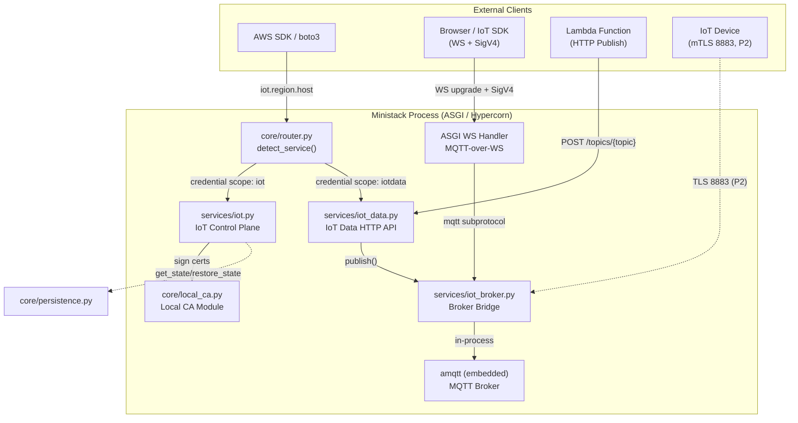
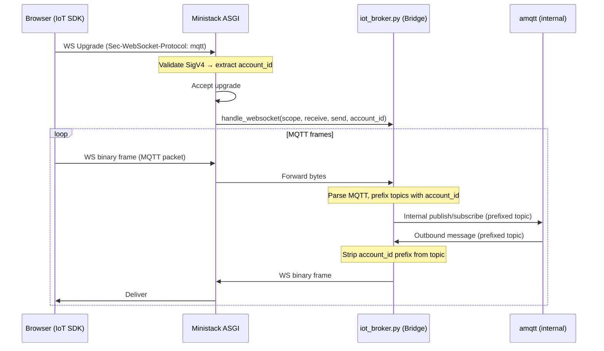
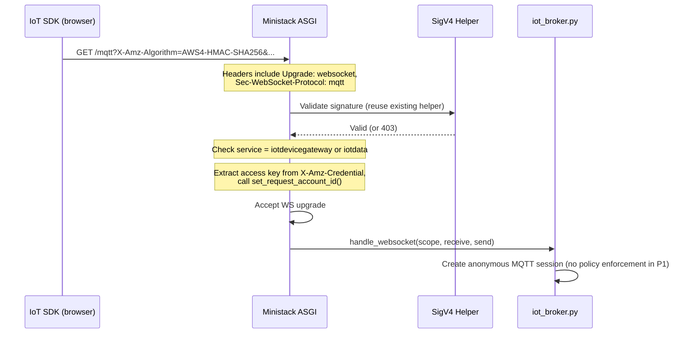
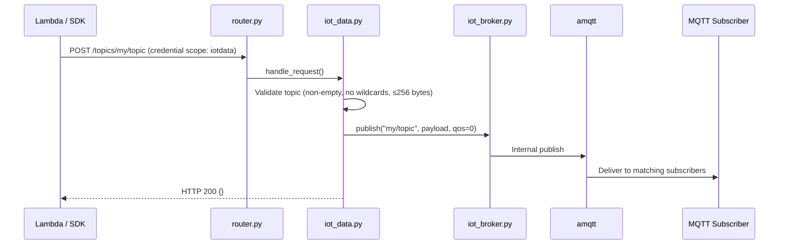

# Design Document — AWS IoT Core (Phase 1a + 1b)

## Overview

This design covers Phase 1a (control plane) and Phase 1b (data plane) of AWS IoT Core support in Ministack. The goal is to unblock the original use case from issue #564: a Lambda function publishes via `iot-data Publish` over HTTP, and a browser subscribes over MQTT-over-WebSockets using the official AWS IoT SDK (SigV4-signed upgrade).

**Phase 1a** delivers the control-plane CRUD service module — Things, ThingTypes, ThingGroups, Certificates (with Local CA), Policies, and `DescribeEndpoint` — as a standard Ministack JSON/REST service with no broker dependency.

**Phase 1b** adds the data plane — an embedded MQTT broker, the Broker Bridge interface, MQTT-over-WebSocket on the gateway port, SigV4-signed WS upgrades, and the `iot-data Publish` HTTP API.

**Future work (out of scope):** Phase 2 (Shadows, mTLS on 8883, GetRetainedMessage) and Phase 3 (Rules Engine, Jobs, Fleet Provisioning) are deferred.

## Architecture



### Key Design Decisions

| Decision | Choice | Rationale |
|----------|--------|-----------|
| Broker strategy | Embedded Python library (`amqtt`) | In-process = zero IPC, simplest Broker Bridge (direct async calls). `amqtt` is a pure-Python MQTT 3.1.1 broker with QoS 0/1, retained messages, wildcards. No binary dependency, no Docker sidecar, no image-size concern. Falls within the `full` optional dependency group alongside `cryptography` and `docker`. |
| MQTT-over-WS port | Multiplexed on gateway port (4566) | Matches AppSync Events pattern. The ASGI app already dispatches WebSocket upgrades by host header. IoT WS uses `Sec-WebSocket-Protocol: mqtt` on the IoT data hostname. |
| DescribeEndpoint hostname | `<prefix>-ats.iot.<region>.<MINISTACK_HOST>` | Follows AWS format. Router matches via `host_patterns: [r"\.iot\."]` and credential scope `iot`/`iotdata`. The prefix is a deterministic hash of the account ID. |
| Local CA placement | `ministack/core/local_ca.py` | Reusable by ACM and API Gateway. Wraps `cryptography` library for CA generation and leaf signing. |
| Phase 1 auth | Anonymous CONNECT only | Simplest path to unblock the use case. SigV4 on WS upgrade is validated (reusing existing SigV4 helper) but does not enforce IoT policies. |
| Multi-tenancy | Single broker, session-level account scoping (Transfer Family pattern) | Control-plane state is isolated per account via `AccountScopedDict`. The MQTT broker is a single shared instance. Account isolation is enforced at the session/bridge layer: SigV4 on WS upgrade identifies the account; in P2, mTLS client certs are looked up to resolve the owning account (same as Transfer Family resolving SFTP users by SSH key). Anonymous TCP connects map to the default account. Topics are internally prefixed with account ID by the bridge, transparent to clients. |

## Components and Interfaces

### Module Layout

```
ministack/
├── core/
│   ├── local_ca.py          # NEW — Local CA (generate CA, sign leaf certs)
│   ├── router.py            # MODIFIED — add "iot" and "iot-data" service patterns
│   ├── persistence.py       # UNCHANGED — used by iot.py via get_state/restore_state
│   └── tls.py               # UNCHANGED
├── services/
│   ├── iot.py               # NEW — IoT control plane (Things, Certs, Policies, Endpoint)
│   ├── iot_data.py          # NEW — iot-data HTTP API (Publish)
│   └── iot_broker.py        # NEW — Broker Bridge + embedded amqtt lifecycle
└── app.py                   # MODIFIED — register iot/iot-data services, add IoT WS dispatch
```

### Service Registration (router.py changes)

```python
# In SERVICE_PATTERNS:
"iot": {
    "host_patterns": [r"iot\."],
    "credential_scope": "iot",
},
"iot-data": {
    "host_patterns": [r"data-ats\.iot\.", r"data\.iot\."],
    "credential_scope": "iotdata",
    "path_prefixes": ["/topics/"],
},
```

```python
# In app.py SERVICE_REGISTRY:
"iot": {"module": "iot"},
"iot-data": {"module": "iot_data"},
```

The `_S3_VHOST_EXCLUDE_RE` pattern in `app.py` will be extended to include `iot` hostnames so they are not misrouted to S3.

### WebSocket Dispatch (app.py changes)

The existing WebSocket dispatch block in `app.py` (line ~1360) checks for `execute-api` and `appsync-realtime-api` hosts. A new check will be added for IoT data hostnames:

```python
_IOT_DATA_WS_RE = re.compile(r"\.iot\." + re.escape(_MINISTACK_HOST) + r"(?::\d+)?$")

# In the websocket scope handler:
iot_ws_m = _IOT_DATA_WS_RE.search(ws_host)
if iot_ws_m:
    # Check Sec-WebSocket-Protocol contains "mqtt"
    await _get_module("iot_broker").handle_websocket(scope, receive, send)
```

### Broker Bridge Interface (`iot_broker.py`)

```python
"""Broker Bridge — manages a single embedded amqtt broker with session-level account scoping.

Follows the Transfer Family SFTP pattern: client-facing listeners are managed by
Ministack (not by the broker). The bridge terminates connections, resolves the
account (via SigV4 on WS, or client cert on mTLS in P2), and relays MQTT frames
to/from the internal broker with transparent topic prefixing.

Architecture:
  Client → [WS on gateway (P1b) / TLS 8883 (P2b)] → Bridge → amqtt (internal)
  
The broker itself has no external listeners. All multi-tenancy logic lives in the bridge.
No plain TCP 1883 — matches real AWS IoT Core which requires TLS or SigV4 on all connections.
"""

import asyncio
from typing import Callable, Awaitable

# Public interface consumed by iot_data.py and (future) rules engine
async def start_broker() -> None:
    """Start the internal broker."""

async def stop_broker() -> None:
    """Graceful shutdown of broker."""

async def publish(account_id: str, topic: str, payload: bytes, qos: int = 0, retain: bool = False) -> None:
    """Publish a message scoped to account_id. Internally prefixes topic."""

async def subscribe(account_id: str, topic_filter: str, callback: Callable[[str, bytes, int], Awaitable[None]]) -> str:
    """Subscribe scoped to account_id. Internally prefixes topic filter. Returns subscription_id."""

async def unsubscribe(subscription_id: str) -> None:
    """Remove a subscription."""

async def handle_websocket(scope: dict, receive, send, account_id: str) -> None:
    """Handle an MQTT-over-WebSocket connection. Account already resolved from SigV4."""

def is_available() -> bool:
    """Return True if amqtt is importable."""
```

**Topic prefixing (transparent to clients):**
- When a client in account `123456789012` publishes to `sensors/temp`, the bridge internally publishes to `123456789012/sensors/temp` on the broker.
- When a client subscribes to `sensors/#`, the bridge subscribes to `123456789012/sensors/#`.
- Outbound messages strip the prefix before delivery to the client.
- This ensures complete topic isolation without running separate broker processes.

The broker is started lazily on first `publish()`, `subscribe()`, or WebSocket connection. Phase 1a control-plane operations work without the broker running.

### IoT Control Plane (`iot.py`)

Follows the standard Ministack service pattern:

```python
async def handle_request(method: str, path: str, headers: dict, body: bytes, query_params: dict) -> tuple:
    """Route IoT control-plane API actions."""

def get_state() -> dict:
    """Return serializable state for persistence."""

def restore_state(data: dict) -> None:
    """Restore state from persistence."""

def reset() -> None:
    """Clear all state (called by /_ministack/reset)."""
```

Actions are dispatched by the `Action` header or `x-amz-target` (IoT uses JSON body with `Action` in the URL path for some operations, but primarily uses the standard AWS JSON 1.1 protocol with target headers).

IoT control-plane actions use the `x-amz-target` pattern: the SDK sends requests with target header values like `AWSIotService.CreateThing`. The router detects the service via credential scope (`iot`) or host pattern (`iot.<region>.<host>`).

### IoT Data HTTP API (`iot_data.py`)

```python
async def handle_request(method: str, path: str, headers: dict, body: bytes, query_params: dict) -> tuple:
    """Handle iot-data HTTP API requests."""
    # POST /topics/{topic} → publish via Broker Bridge
    # Future: GET /retainedMessage/{topic}, GET /retainedMessages
```

### Local CA Module (`core/local_ca.py`)

```python
"""Local Certificate Authority for Ministack.

Generates a self-signed root CA on first use and signs leaf certificates
for IoT CreateKeysAndCertificate, ACM certificate issuance, and API Gateway
custom domain TLS.

IMPORTANT: Unlike the gateway TLS cert in tls.py (ephemeral, regenerated on
cold start), the Local CA is a mocked AWS resource. The CA key and cert MUST
be persisted via the standard persistence mechanism (STATE_DIR) when
PERSIST_STATE=1, because:
  - Client certs issued by CreateKeysAndCertificate reference this CA
  - mTLS validation in P2 requires the CA to be stable across restarts
  - Losing the CA key invalidates all previously issued certs

Requires: cryptography>=41.0 (in [full] optional deps)
"""

def get_ca_cert_pem() -> str:
    """Return the CA certificate in PEM format. Generates CA if not exists."""

def get_ca_key_pem() -> str:
    """Return the CA private key in PEM format (for signing only, never exposed via API)."""

def sign_leaf_certificate(
    common_name: str,
    san_dns: list[str] | None = None,
    san_ips: list[str] | None = None,
    days_valid: int = 825,
    key_type: str = "rsa2048",  # or "ec256"
) -> tuple[str, str, str]:
    """Generate a keypair and sign a leaf cert.
    
    Returns: (cert_pem, private_key_pem, public_key_pem)
    """

def get_certificate_id(cert_pem: str) -> str:
    """Extract the certificate fingerprint used as certificateId."""

def get_state() -> dict:
    """Return CA cert + key PEMs for persistence. Called by iot.py's get_state."""

def restore_state(data: dict) -> None:
    """Restore CA from persisted state. Called on startup."""
```

**Persistence model:** The CA cert and private key are stored as PEM strings inside the IoT service's `get_state()` output (alongside Things, Certs, Policies). When `PERSIST_STATE=1`, they're saved to `STATE_DIR/iot.json` and restored on startup. This is different from `tls.py` which caches in `${TMPDIR}` and regenerates freely — the Local CA is a resource that other resources (issued certs) depend on.

**First-use generation:** If no persisted state exists, the CA is generated lazily on first `CreateKeysAndCertificate` call and included in the next `get_state()` snapshot.

## Data Models

All records are stored in `AccountScopedDict` instances within `iot.py`.

### Thing

```python
{
    "thingName": str,
    "thingId": str,          # UUID
    "thingArn": str,         # arn:aws:iot:{region}:{account}:thing/{name}
    "thingTypeName": str | None,
    "attributes": dict[str, str],
    "version": int,          # starts at 1, increments on update
    "principals": list[str], # attached certificate ARNs
}
```

### ThingType

```python
{
    "thingTypeName": str,
    "thingTypeId": str,
    "thingTypeArn": str,
    "thingTypeProperties": {
        "thingTypeDescription": str | None,
        "searchableAttributes": list[str],
    },
    "thingTypeMetadata": {
        "deprecated": bool,
        "deprecationDate": str | None,  # ISO 8601
        "creationDate": str,
    },
}
```

### ThingGroup

```python
{
    "thingGroupName": str,
    "thingGroupId": str,
    "thingGroupArn": str,
    "thingGroupProperties": {
        "thingGroupDescription": str | None,
        "attributePayload": {"attributes": dict[str, str]},
    },
    "version": int,
    "things": list[str],  # thing names in this group
}
```

### Certificate

```python
{
    "certificateId": str,       # SHA-256 fingerprint of DER
    "certificateArn": str,
    "certificatePem": str,
    "status": str,              # ACTIVE | INACTIVE | REVOKED | PENDING_TRANSFER | PENDING_ACTIVATION
    "creationDate": str,        # ISO 8601
    "ownedBy": str,             # account ID
    "caCertificateId": str | None,
    "attachedThings": list[str],   # thing ARNs
    "attachedPolicies": list[str], # policy names
}
```

### Policy

```python
{
    "policyName": str,
    "policyArn": str,
    "policyDocument": str,      # raw JSON string
    "defaultVersionId": str,    # "1", "2", ...
    "versions": {
        "1": {"document": str, "isDefaultVersion": bool, "createDate": str},
        # ...
    },
    "targets": list[str],       # attached certificate ARNs / thing group ARNs
}
```

### Endpoint (computed, not stored)

```python
{
    "endpointAddress": f"{prefix}-ats.iot.{region}.{MINISTACK_HOST}:{port}",
    # prefix = first 14 chars of SHA-256(account_id) to mimic AWS's opaque identifier
}
```

## DescribeEndpoint Hostname Scheme

AWS returns endpoints like `a1b2c3d4e5f6g7-ats.iot.us-east-1.amazonaws.com`. Ministack will return:

```
{prefix}-ats.iot.{region}.{MINISTACK_HOST}:{GATEWAY_PORT}
```

Where `prefix` = `hashlib.sha256(account_id.encode()).hexdigest()[:14]`.

The router matches this via `host_patterns: [r"\.iot\."]` in the `iot-data` service pattern. The `iot-data` credential scope (`iotdata`) also routes correctly when the SDK signs requests.

For the WebSocket upgrade path, the same hostname is used. The ASGI WebSocket dispatcher checks for `.iot.` in the host and the `mqtt` subprotocol to route to `iot_broker.handle_websocket`.

## Broker Integration: Embedded `amqtt`

### Why `amqtt`

| Option | Pros | Cons |
|--------|------|------|
| `amqtt` (embedded Python) | Pure Python, async, in-process, zero IPC, direct Bridge calls, no image size impact | Python-only, no MQTT 5.0, moderate throughput |
| Mosquitto sidecar | Battle-tested, high throughput | Requires Docker, IPC over TCP, complex Bridge, breaks single-binary story |
| `mochi-mqtt` (Go binary) | Fast, small binary | Cross-compile needed, IPC over TCP, startup coordination |

`amqtt` wins because:
1. **In-process** — the Broker Bridge is just async function calls, no serialization or network hops.
2. **Pure Python** — no binary compilation, works on all platforms Ministack supports.
3. **Async-native** — integrates naturally with Hypercorn's event loop.
4. **Sufficient for local testing** — throughput is irrelevant for dev/test workloads.
5. **Optional dependency** — added to `[full]` extras alongside `cryptography` and `docker`.

### Broker Lifecycle

```python
# iot_broker.py internals
_broker: "amqtt.broker.Broker | None" = None
_broker_lock = asyncio.Lock()

async def _ensure_broker() -> "Broker":
    """Start the single broker if not running. Thread-safe via lock."""
    global _broker
    if _broker is not None:
        return _broker
    async with _broker_lock:
        if _broker is not None:
            return _broker
        config = {
            "listeners": {
                # Internal only — no external TCP listener.
                # All client connections go through the bridge layer.
                "default": {"type": "tcp", "bind": "127.0.0.1:0"},  # ephemeral port, loopback only
            },
            "auth": {"allow-anonymous": True},
            "topic-check": {"enabled": False},
        }
        _broker = Broker(config)
        await _broker.start()
        logger.info("IoT MQTT: internal broker started")
        return _broker

def _scoped_topic(account_id: str, topic: str) -> str:
    """Prefix topic with account ID for isolation."""
    return f"{account_id}/{topic}"

def _unscope_topic(account_id: str, scoped_topic: str) -> str:
    """Strip account prefix from topic before delivering to client."""
    prefix = f"{account_id}/"
    if scoped_topic.startswith(prefix):
        return scoped_topic[len(prefix):]
    return scoped_topic
```

One internal broker instance — no external TCP listener exposed by `amqtt` itself. All client-facing listeners (TCP 1883, TLS 8883, WS on gateway) are managed by Ministack's bridge layer, which terminates the connection, resolves the account, and relays MQTT frames to/from the broker with topic prefixing. This mirrors how Transfer Family's shared SFTP listener resolves users by SSH key at the session level.

### MQTT-over-WebSocket Flow



The broker never sees the raw WebSocket connection. The bridge layer parses MQTT frames, applies topic prefixing, and relays to/from the internal broker. This same pattern applies to mTLS (P2) and anonymous TCP connections — only the account resolution method differs.

### SigV4 WebSocket Upgrade Flow



The SigV4 validation reuses the same code path that AppSync Events and API Gateway v2 WebSocket upgrades use. The IoT WS handler extracts the `X-Amz-Algorithm` query parameter (or `Authorization` header) and validates the signature. In Phase 1, validation succeeds for any valid AWS credentials — IoT policy enforcement is deferred.

**Multi-tenancy on WS upgrade:** The handler extracts the access key ID from the `X-Amz-Credential` query parameter and calls `set_request_account_id()`. The resolved account ID is passed to `handle_websocket()` so the bridge can prefix topics for that session. This ensures complete topic isolation between accounts on the shared broker.

### `iot-data Publish` HTTP Flow



## Error Handling

### Control Plane Errors

All control-plane errors follow the standard AWS JSON error format:

```json
{
    "__type": "ResourceNotFoundException",
    "message": "Thing not-a-thing not found"
}
```

| Condition | HTTP Status | Error Type |
|-----------|-------------|------------|
| Thing/Cert/Policy not found | 404 | `ResourceNotFoundException` |
| Thing already exists (different config) | 409 | `ResourceAlreadyExistsException` |
| Delete active certificate | 409 | `CertificateStateException` |
| Malformed policy JSON | 400 | `MalformedPolicyException` |
| Invalid parameter | 400 | `InvalidRequestException` |
| Broker unavailable on Publish | 503 | `InternalFailureException` |

### Data Plane Errors

| Condition | Response |
|-----------|----------|
| Invalid topic on HTTP Publish | HTTP 400 `InvalidRequestException` |
| Broker not started on Publish | HTTP 503 `InternalFailureException` |
| Invalid SigV4 algorithm on WS upgrade | HTTP 400, connection rejected |
| Wrong service name in SigV4 scope | HTTP 403, connection rejected |
| Anonymous CONNECT (Phase 1) | CONNACK 0x00 (accepted) |

### Graceful Degradation

The control plane (`iot.py`) never calls the broker. It operates independently. Only `iot_data.py` and `iot_broker.py` depend on the broker being available. If `amqtt` is not installed (base install without `[full]`), the control plane still works; data-plane operations return 503 with a clear error message.

### Multi-Tenancy and Account Isolation

**Control plane:** Fully isolated per account. All state containers (`_things`, `_certificates`, `_policies`, etc.) are `AccountScopedDict` instances. The account ID is extracted per-request from the SigV4 `Credential` field's access key (if it's a 12-digit number, it IS the account ID; otherwise falls back to `MINISTACK_ACCOUNT_ID` env var or `000000000000`).

**Data plane (MQTT broker) — single broker, session-level scoping:**

Following the Transfer Family SFTP pattern (one listener, multi-tenancy resolved at the session level), we run a single `amqtt` broker instance. Account isolation is enforced by the bridge layer through transparent topic prefixing:

- **SigV4-over-WS (P1b):** Account ID extracted from `X-Amz-Credential` on the WS upgrade. The bridge prefixes all topics for that session with the account ID.
- **mTLS on 8883 (P2):** Client certificate is looked up in the Certificate registry to find the owning account — same pattern as Transfer Family resolving SFTP users by SSH public key.
- **Anonymous TCP on 1883 (P1b, local convenience):** Maps to the default account (`MINISTACK_ACCOUNT_ID` or `000000000000`). Note: real AWS IoT Core does NOT offer unencrypted MQTT on port 1883 — all connections require TLS. Port 1883 is a Ministack convenience for local testing without cert setup.
- **HTTP Publish:** Account ID from the request's SigV4 credentials (standard HTTP path).

**Topic prefixing (transparent to clients):**
```
Client publishes to:  sensors/temp
Broker sees:          {account_id}/sensors/temp
Client subscribes to: sensors/#
Broker subscribes:    {account_id}/sensors/#
Delivered to client:  sensors/temp  (prefix stripped)
```

This gives complete topic isolation without running separate broker processes. The single-account case (most common) has zero overhead — the prefix is just `000000000000/`.

**How each connection type resolves the account and applies prefixing:**

| Connection type | Phase | Account resolution | Topic prefixing applied by |
|---|---|---|---|
| MQTT-over-WS (SigV4) | P1b | Extract from `X-Amz-Credential` on WS upgrade | Bridge (ASGI → broker) |
| mTLS on 8883 | P2b | Ministack terminates TLS, extracts client cert, looks up `certificateId` → account | Bridge (TLS terminator → broker) |
| HTTP Publish (`iot-data`) | P1b | Standard SigV4 from HTTP request | Bridge (`iot_data.py` → broker) |

**Note:** There is no plain TCP port 1883. Real AWS IoT Core does not offer unencrypted MQTT — all connections require TLS or SigV4. Ministack follows the same model: MQTT-over-WS (P1b) and mTLS on 8883 (P2b) are the only MQTT transports.

**DescribeEndpoint:** Returns a per-account hostname for SDK compatibility. All hostnames route to the same broker; the bridge resolves the account from the connection's auth context, not from the hostname.

## Configuration

| Environment Variable | Default | Description |
|---------------------|---------|-------------|
| `IOT_MTLS_PORT` | `8883` | Client-facing TCP port for mTLS MQTT (Phase 2b, bridge-managed, account from cert) |
| `MINISTACK_HOST` | `localhost` | Base hostname for endpoint generation |
| `GATEWAY_PORT` | `4566` | Port for HTTP + WS (including MQTT-over-WS with SigV4) |
| `IOT_BROKER_ENABLED` | `1` | Set to `0` to disable broker startup (control plane only) |

## Correctness Properties

*A property is a characteristic or behavior that should hold true across all valid executions of a system — essentially, a formal statement about what the system should do. Properties serve as the bridge between human-readable specifications and machine-verifiable correctness guarantees.*

### Property 1: Thing CRUD round-trip

*For any* valid thing name (1–128 chars, `[a-zA-Z0-9:_-]`) and any valid attributes map (up to 3 entries, string keys/values), creating a Thing and then describing it SHALL return the same thingName, attributes, and thingTypeName that were supplied at creation time.

**Validates: Requirements 2.1, 2.3**

### Property 2: CreateThing idempotency

*For any* valid thing configuration, calling CreateThing twice with the same thingName and identical configuration SHALL return success both times. Calling CreateThing with the same thingName but a different configuration SHALL return a `ResourceAlreadyExistsException` (409).

**Validates: Requirements 2.2**

### Property 3: ListThings filter correctness

*For any* set of Things with varying attributes and thingTypeNames, calling ListThings with an `attributeName`/`attributeValue` filter SHALL return exactly those Things whose attributes contain the specified key-value pair, and calling with a `thingTypeName` filter SHALL return exactly those Things with that type.

**Validates: Requirements 2.5**

### Property 4: UpdateThing version increment invariant

*For any* existing Thing at version V, calling UpdateThing SHALL result in the Thing's version becoming V+1, regardless of what attributes are changed.

**Validates: Requirements 2.6**

### Property 5: DeleteThing detaches principals

*For any* Thing with one or more attached Certificates, calling DeleteThing SHALL remove the Thing from the registry AND remove the Thing from each Certificate's `attachedThings` list.

**Validates: Requirements 2.7**

### Property 6: Certificate issuance produces valid X.509 signed by Local CA

*For any* call to CreateKeysAndCertificate with `setAsActive` in {true, false}, the returned `certificatePem` SHALL be a valid X.509 certificate whose issuer matches the Local CA's subject, and the persisted Certificate record's status SHALL equal `"ACTIVE"` when `setAsActive=true` and `"INACTIVE"` when `setAsActive=false`.

**Validates: Requirements 3.2, 3.3**

### Property 7: RegisterCertificate preserves PEM verbatim

*For any* syntactically valid PEM certificate string, calling RegisterCertificate and then retrieving the Certificate record SHALL return a `certificatePem` field byte-for-byte identical to the input.

**Validates: Requirements 3.5**

### Property 8: UpdateCertificate status transition

*For any* existing Certificate and any valid target status in {ACTIVE, INACTIVE, REVOKED, PENDING_TRANSFER, PENDING_ACTIVATION}, calling UpdateCertificate SHALL result in the Certificate's status equaling the supplied `newStatus`.

**Validates: Requirements 3.6**

### Property 9: AttachThingPrincipal / DetachThingPrincipal round-trip

*For any* existing Thing and Certificate, calling AttachThingPrincipal SHALL cause the Certificate ARN to appear in ListThingPrincipals for that Thing AND the Thing ARN to appear in ListPrincipalThings for that Certificate. Subsequently calling DetachThingPrincipal SHALL remove both associations.

**Validates: Requirements 3.8**

### Property 10: Policy version numbering

*For any* newly created Policy, the initial `defaultVersionId` SHALL be `"1"`. For any subsequent CreatePolicyVersion call with `setAsDefault=true`, the new version's ID SHALL be one greater than the previous maximum version ID, and the Policy's `defaultVersionId` SHALL point to the new version.

**Validates: Requirements 4.1, 4.3**

### Property 11: Policy attachment round-trip

*For any* existing Policy and valid target (Certificate ARN or ThingGroup ARN), calling AttachPolicy SHALL cause the target to appear in ListTargetsForPolicy AND the policy to appear in ListAttachedPolicies for that target. Calling DetachPolicy SHALL remove both associations.

**Validates: Requirements 4.4, 4.5**

### Property 12: Invalid topic rejection on HTTP Publish

*For any* topic string that is empty, contains a `+` character, contains a `#` character, or exceeds 256 bytes in UTF-8 encoding, calling `POST /topics/{topic}` SHALL return HTTP 400 with an `InvalidRequestException` body.

**Validates: Requirements 7.4**

### Property 13: Persistence round-trip (get_state / restore_state)

*For any* set of Things, Certificates, Policies, ThingTypes, and ThingGroups created via the control plane, calling `get_state()` followed by `reset()` followed by `restore_state(saved)` SHALL result in all records being retrievable with identical field values.

**Validates: Requirements 15.2, 15.3**

### Property 14: Message ordering preservation

*For any* sequence of N messages published by a single publisher to a single topic at QoS 1, a subscriber on that topic SHALL receive all N messages in the same order they were published.

**Validates: Requirements 6.7**

## Testing Strategy

### Unit Tests (example-based)

Located at `tests/test_iot.py`:

- Control-plane CRUD happy paths (CreateThing, DescribeThing, ListThings, UpdateThing, DeleteThing)
- ThingType and ThingGroup CRUD
- Certificate lifecycle (Create, Register, Update status, Delete with active guard)
- Policy CRUD and versioning
- DescribeEndpoint format validation
- Error cases (404, 409, 400 for each resource type)
- Account isolation (two accounts don't see each other's Things)

Located at `tests/test_iot_data.py`:

- HTTP Publish end-to-end (publish via HTTP, receive via MQTT subscriber)
- SigV4 WebSocket upgrade acceptance
- SigV4 rejection (wrong algorithm, wrong service name)
- Broker unavailable → 503
- Invalid topic → 400

### Property-Based Tests (hypothesis)

Library: **hypothesis** (Python PBT library, already compatible with pytest)

Each property test runs a minimum of **100 iterations** with randomized inputs.

Tag format: `# Feature: iot-core, Property {N}: {title}`

Properties 1–13 test pure control-plane logic (in-process, no broker needed). Property 14 tests message ordering and requires the broker to be running.

### Integration Tests

- End-to-end: Lambda publishes via HTTP → broker delivers to WS subscriber (the original use case)
- MQTT client connects on TCP 1883, subscribes, receives messages
- Retained messages: publish with retain, new subscriber gets last retained
- Wildcard subscriptions: `+` and `#` patterns

### Test Dependencies

```
# Added to [dev] extras:
hypothesis>=6.100
paho-mqtt>=2.0       # MQTT client for integration tests
```

## Appendix: Dependency Addition

`amqtt` is added to `[full]` optional dependencies in `pyproject.toml`:

```toml
[project.optional-dependencies]
full = [
    # ... existing ...
    "amqtt>=0.11",
]
```

When `amqtt` is not installed, `iot_broker.py` catches the `ImportError` and `is_available()` returns `False`. All data-plane operations return 503. Control-plane operations are unaffected.

## Appendix: Local CA Endpoint

The Local CA root certificate is served at:

```
GET /_ministack/iot/ca.pem
```

This allows test code to configure MQTT clients and SDKs to trust the local CA for mTLS (Phase 2). The endpoint is handled directly in `app.py` as a pre-body handler (similar to `/_ministack/health`).
